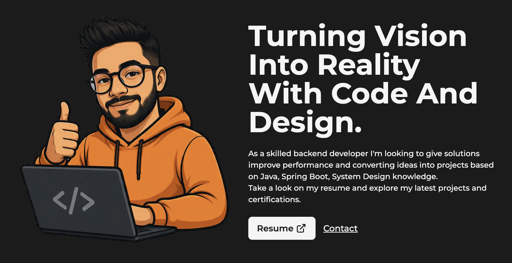

## 👋 About Me

- 💼 Java Software Engineer (Backend) with close to **3 years of hands-on experience at Oracle**
- 🛠️ Design, build, and maintain an internal Java/SQL automation platform used to validate Oracle RDBMS 19c patch cycles
- ⚙️ Automated infrastructure provisioning with Ansible, cutting multi-cluster setup time from hours to minutes
- 🧪 Built CI/CD-integrated test cases and tracked full test workflows through Jira
- 🌱 Currently completing certifications in **Azure** (Microsoft - AZ-900) 

## 🧰 Tech Stack

 

## 🚀 Projects

## 📊 GitHub Stats

